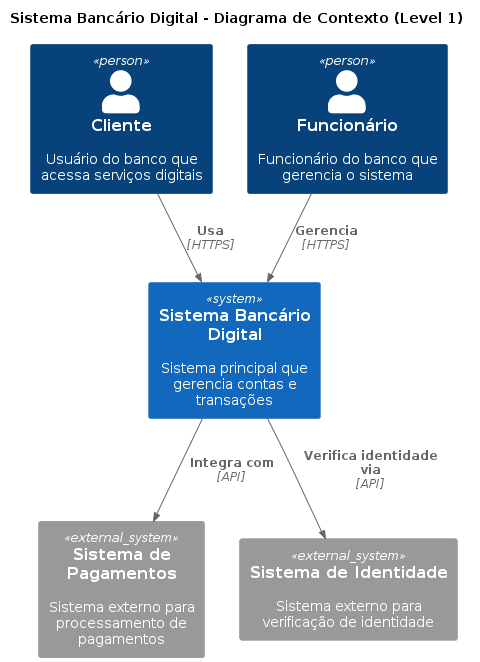
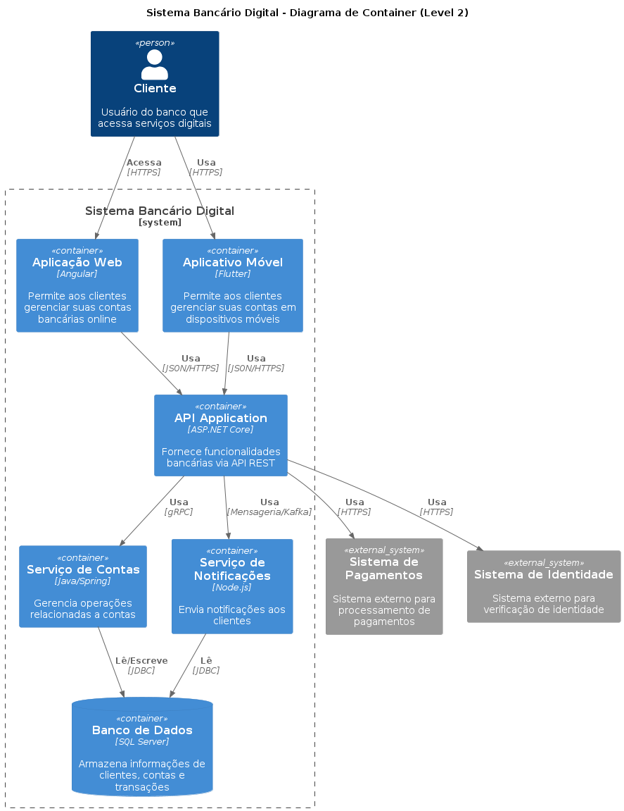
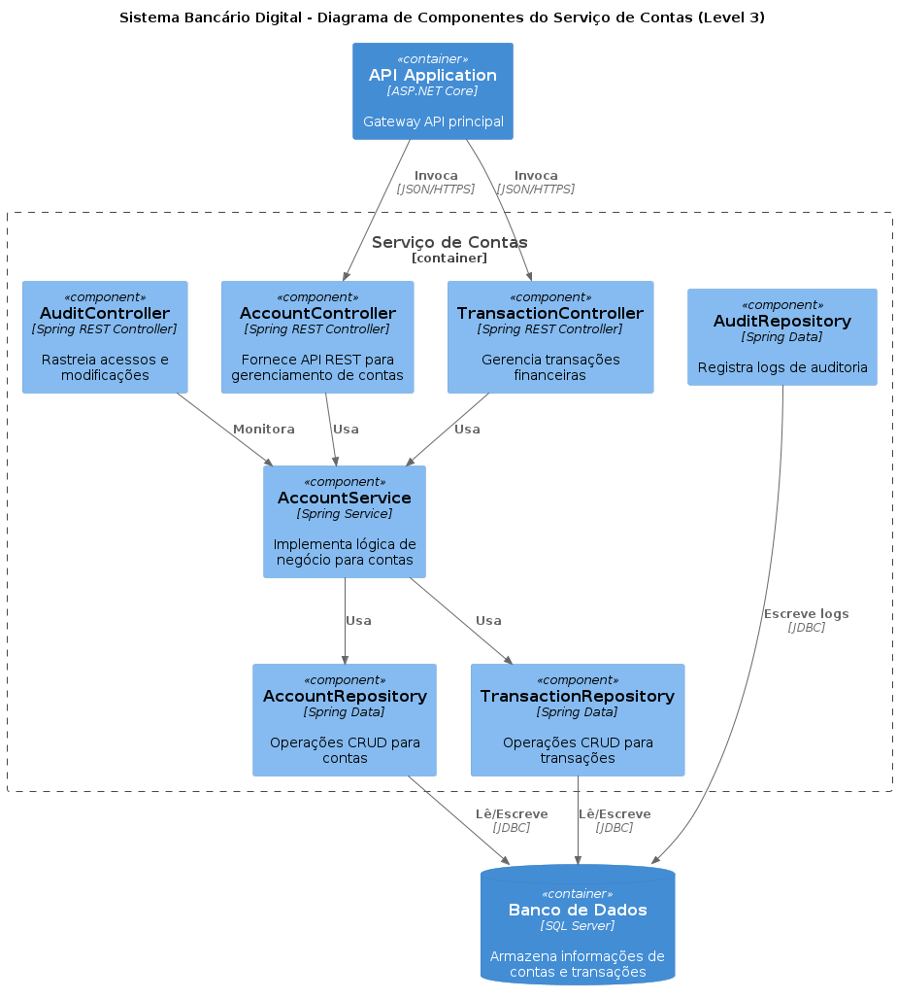
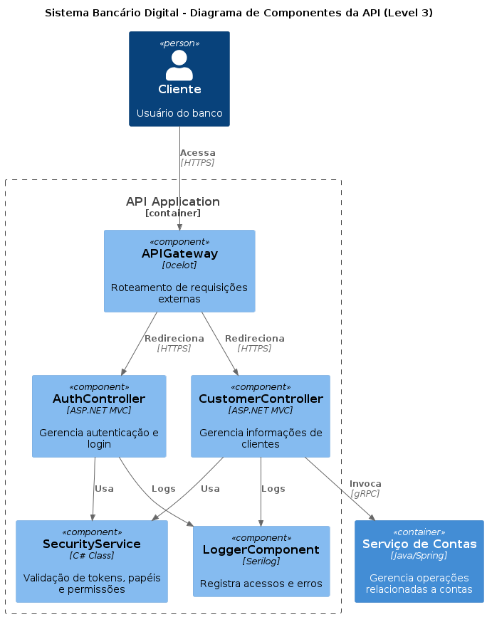
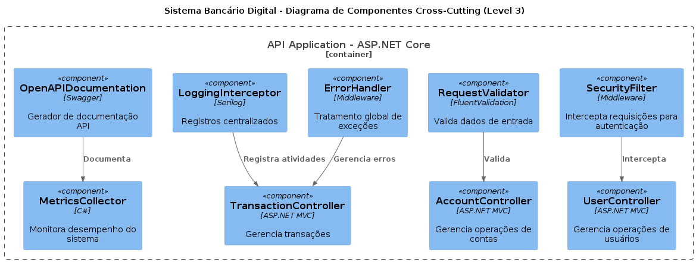
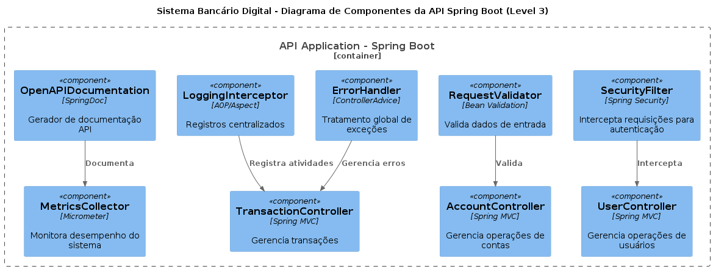
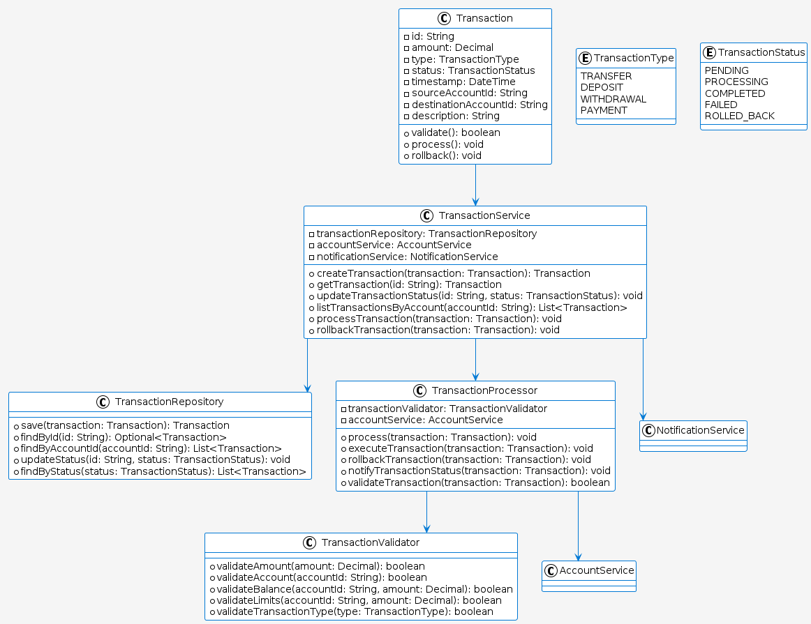
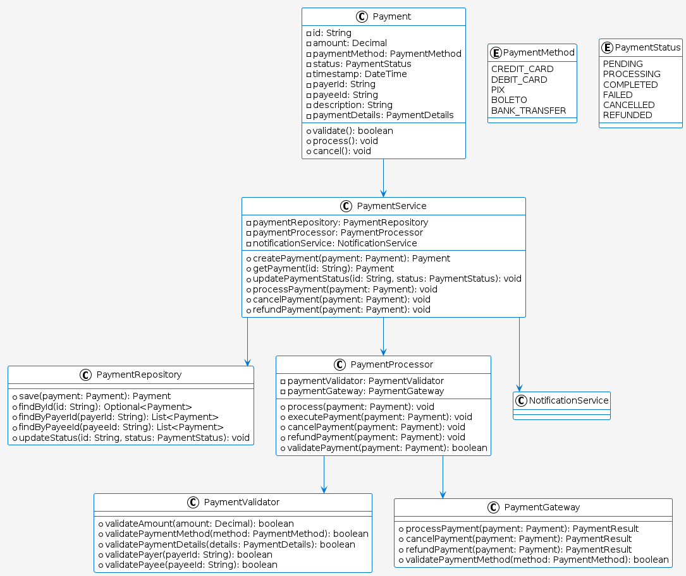

# C4 Model - Digital Bank Architecture

Este projeto é um estudo prático sobre o C4 Model, apresentado na comunidade de arquitetura da empresa GFT Technologies Brasil, uma abordagem moderna e eficaz para documentação de arquitetura de software. O objetivo principal é demonstrar como o C4 Model pode melhorar a comunicação entre todas as partes interessadas em um projeto de software, desde desenvolvedores até stakeholders não técnicos.

## 🎯 Objetivos

- Demonstrar a aplicação prática do C4 Model em um sistema bancário digital
- Facilitar a compreensão da arquitetura do sistema em diferentes níveis de abstração
- Melhorar a comunicação entre equipes técnicas e não técnicas
- Documentar as decisões arquiteturais de forma clara e estruturada
- Promover o uso de boas práticas na documentação de arquitetura

## 📊 Diagramas C4

O projeto inclui os seguintes diagramas:

1. **Diagrama de Contexto (Level 1)**
   - Visão geral do sistema e suas interações com usuários e sistemas externos
   - Foco nas pessoas e sistemas que interagem com o sistema bancário
   - Diagrama: `context_diagram.png`
   
   

2. **Diagrama de Container (Level 2)**
   - Detalhamento dos principais componentes do sistema
   - Apresentação das tecnologias utilizadas em cada container
   - Mapeamento das interações entre containers
   - Diagrama: `container_diagram.png`
   
   

3. **Diagrama de Componentes (Level 3)**
   - Detalhamento da estrutura interna dos containers
   - Documentação dos componentes principais e suas responsabilidades
   - Mapeamento das dependências entre componentes
   - Diagramas:
     - `component_account_service_diagram.png`: Componentes do serviço de contas
     - `component_api_diagram.png`: Componentes da API principal
     - `component_api_crosscutting_diagram.png`: Componentes cross-cutting da API
     - `component_api_springboot_diagram.png`: Componentes da API Spring Boot
   
   
   
   
   

4. **Diagramas de Código (Level 4)**
   - Detalhamento da implementação de funcionalidades específicas
   - Documentação das classes e suas relações
   - Exemplos práticos de implementação
   - Diagramas:
     - `code_transaction_management.png`: Gerenciamento de transações
     - `code_payment_processing.png`: Processamento de pagamentos
   
   
   

## 🛠️ Tecnologias Utilizadas

- **PlantUML**: Ferramenta principal para geração dos diagramas
- **C4-PlantUML**: Biblioteca que estende o PlantUML para suporte ao C4 Model
- **Java**: Runtime necessário para execução do PlantUML

## 📚 Recursos da Comunidade PlantUML

### Documentação Oficial
- [Site Oficial do PlantUML](https://plantuml.com/)
- [Documentação do C4-PlantUML](https://github.com/plantuml-stdlib/C4-PlantUML)
- [Exemplos de Diagramas](https://plantuml.com/examples)

### Comunidade e Suporte
- [Fórum do PlantUML](https://forum.plantuml.net/)
- [Stack Overflow - Tag PlantUML](https://stackoverflow.com/questions/tagged/plantuml)
- [GitHub - PlantUML](https://github.com/plantuml/plantuml)

### Tutoriais e Guias
- [C4 Model - Documentação](https://c4model.com/)
- [PlantUML Cheat Sheet](https://plantuml.com/cheat-sheet)
- [C4 Model Cheat Sheet](https://github.com/plantuml-stdlib/C4-PlantUML/blob/master/samples/C4_Container%20Diagram%20Sample.md)

## 🏗️ Estrutura do Projeto

```
.
├── c4_model_digitalbank.puml    # Arquivo principal com todos os diagramas
├── src/
│   └── plantuml/
│       └── diagramas/          # Pasta contendo todos os diagramas gerados
│           ├── L1-Context/
│           │   └── context_diagram.png
│           ├── L2-Container/
│           │   └── container_diagram.png
│           ├── L3-component/
│           │   ├── component_account_service_diagram.png
│           │   ├── component_api_diagram.png
│           │   ├── component_api_crosscutting_diagram.png
│           │   └── component_api_springboot_diagram.png
│           └── L4-code/
│               ├── code_transaction_management.png
│               └── code_payment_processing.png
└── README.md                   # Este arquivo
```

## 🚀 Como Usar

1. Instale o Java Runtime Environment (JRE)
2. Baixe o PlantUML (plantuml.jar)
3. Execute o comando para gerar os diagramas:
   ```bash
   java -jar plantuml.jar c4_model_digitalbank.puml -o src/plantuml/diagramas
   ```

## 🤝 Contribuições

Contribuições são bem-vindas! Se você quiser melhorar este projeto, por favor:

1. Faça um fork do projeto
2. Crie uma branch para sua feature (`git checkout -b feature/AmazingFeature`)
3. Commit suas mudanças (`git commit -m 'Add some AmazingFeature'`)
4. Push para a branch (`git push origin feature/AmazingFeature`)
5. Abra um Pull Request

## 📝 Licença

Este projeto está sob a licença MIT. Veja o arquivo [LICENSE](LICENSE) para mais detalhes.

## 🙏 Agradecimentos

- [Simon Brown](https://simonbrown.je/) - Criador do C4 Model
- Comunidade PlantUML - Pelo excelente trabalho na ferramenta
- Todos os contribuidores do C4-PlantUML 